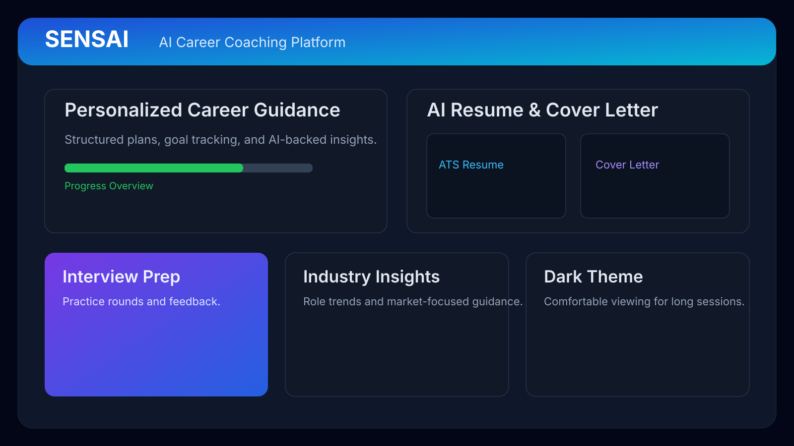
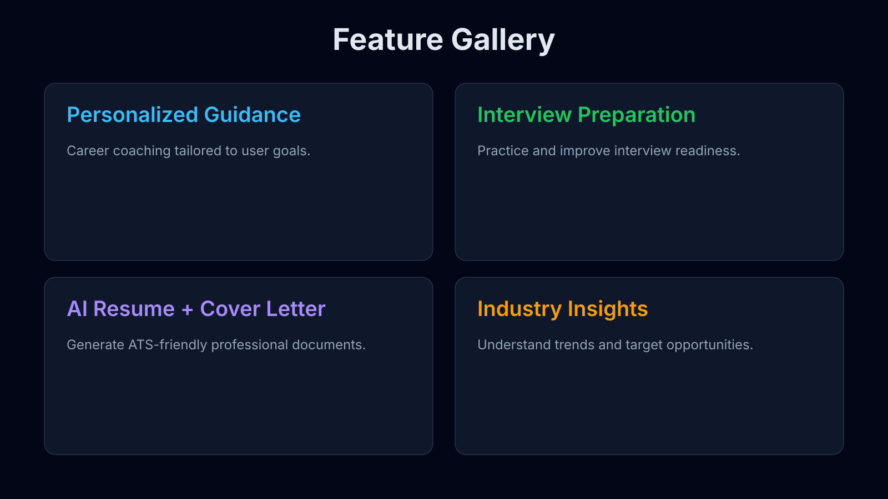

# SENSAI

> AI powered career coaching platform with personalized guidance, AI resume & cover letter generation, interview preparation and industry insights.

  

  

## Project Showcase

  

## Overview

SENSAI is presented in this repository as an AI-first career coaching experience focused on personalized growth and job-readiness outcomes.

## Features

<table>
  <tr>
    <td width="50%" valign="top">
      <h3>Personalized Career Guidance</h3>
      
Goal-oriented coaching and progress-focused recommendations.

    </td>
    <td width="50%" valign="top">
      <h3>Interview Preparation</h3>
      
Practice-driven interview support to improve confidence and readiness.

    </td>
  </tr>
  <tr>
    <td width="50%" valign="top">
      <h3>AI Resume Builder</h3>
      
ATS-conscious resume generation for professional applications.

    </td>
    <td width="50%" valign="top">
      <h3>AI Cover Letter Generator</h3>
      
Tailored cover-letter drafting aligned to role context.

    </td>
  </tr>
  <tr>
    <td width="50%" valign="top">
      <h3>Industry Insights</h3>
      
Insights to help users track market direction and career fit.

    </td>
    <td width="50%" valign="top">
      <h3>Dark-Theme Friendly Experience</h3>
      
Readable visual design intended for focused, extended sessions.

    </td>
  </tr>
</table>

## Architecture

The current repository snapshot is documentation-first and does not include application source files for architecture-level inspection.

## Tech Stack

Technology details are not included in this repository snapshot beyond the high-level product description above.

## Authentication Flow

Authentication implementation files are not present in the current repository snapshot.

## AI Integration

README-level product positioning indicates AI-assisted guidance and document-generation workflows.

## Application Flow

The documented user journey centers on:
1. Career guidance and goal planning
2. Resume and cover letter generation
3. Interview preparation
4. Industry insight review

## Project Screenshots

  <table>
    <tr>
      <td align="center" width="50%">
        
         Main SENSAI experience overview
      </td>
      <td align="center" width="50%">
        
         Core feature gallery
      </td>
    </tr>
  </table>

